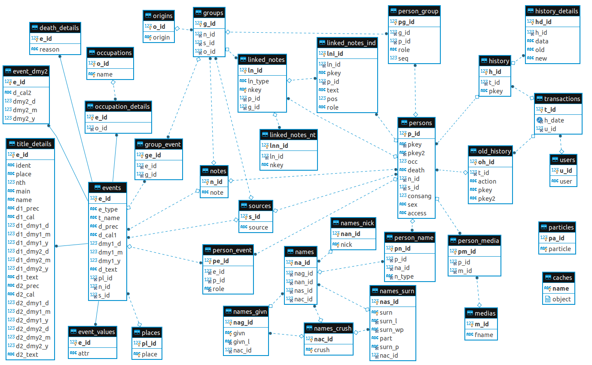

## Export d'une base GeneWeb dans une base MariaDB

À force d'étudier des axes d'amélioration de GeneWeb, je me suis rendu compte qu'il est nécessaire de revoir le modèle de données. Un des axes d'amélioration est d'utiliser un système de gestion de base de données (SGBD) afin d'avoir une plus grande souplesse d'évolution. J'ai retenu MariaDB mais il doit être possible de transposer à d'autres SGBD. N'étant pas encore prêt à coder un module d'échange entre GeneWeb et MySQL, j'ai opté pour une étape intermédiaire : créer un outil de migration d'une base GeneWeb dans une base MariaDB. Avec ce clone sous MariaDB, il sera ainsi plus facile d'étudier différentes options :
* d'amélioration des performances. L'imposante base [Roglo](http://roglo.eu/roglo) n'est pas fonctionnelle avec GeneWeb v7 car GeneaNet, mainteneur officiel, n'a pas su faire évoluer le modèle gwc2 qui avait été mis au point par Daniel de Rauglaudre en v5 pour des besoins de performances.
* d'ajout de nouvelles fonctionnalités. J'ai l'espoir de me rapprocher du modèle [GenTech](https://www.ngsgenealogy.org/history/) qui malgré ses 20 ans ne semble pas avoir été adopté par les principaux logiciels de généalogie alors qu'il est évident que ce modèle est pertinent.

### Création de la base MariaDB
```
sudo mysql -u root -p
```
Renseigner le mot de passe puis valider avec `Entrée`
Puis, dans la console `MariaDB>` :
`
create database geneweb character set UTF8;
create user 'gw'@'localhost' identified by 'gw_pw';
grant all privileges on geneweb.* to 'gw'@'localhost';
exit
`

### Lancer la migration

Pré-requis :

> opam install batteries

Lancer le script `./run.sh` qui va enchaîner les étapes suivantes :
* Compilation de l'extracteur Ocaml (j'utilise la version 4.07)
* Création des tables dans la base MariaDB (écrase les donnnées issues des précédentes migrations)
* Exécution de l'extracteur
* Exécution des scripts de transformations (actuellement changePlaces.sql, changeSources.sql, occupationsChange.sql)

Lancer le script `./run2.sh` qui va enchaîner les étapes suivantes :
* Compilation de l'extracteur Ocaml (j'utilise la version 4.07)
* Création des tables dans la base MariaDB pour la partie historique (écrase les donnnées issues des précédentes migrations)
* Exécution de l'extracteur
* Exécution des scripts de transformations (actuellement changeHistory.sql)
* Chargement de l'ancien système d'histique (via load_old_history.sql)

Je conserve un ancêtre des notes liées (gérées via PHP) que je charge avec `./load_php_notes.sh`.

Pour info, j'ai préparé quelques scripts SQL que vous pouvez lancer en prenant soin de choisir un identifiant de personne (<p_id>) ou de source (<s_id>) :

`
./mysql.sh -t
MariaDB> set @id = <p_id> ; \. p_id2person.sql
MariaDB> set @id = <p_id> ; \. p_id2asc.sql
MariaDB> set @id = <s_id> ; \. s_id2pkey2.sql
`

### État du modèle


Les principales tables sont :
* persons : une ligne pour chaque personne
  * person_event : permet de lier les événements aux personnes avec un attribut permettant de connaître le rôle de la personne. Il faudrait également ajouter un lien vers names pour mémoriser le nom utilisé lors de l'événement.
  * person_group : permet de lier les groupes (familles) aux personnes avec un attribut rôle qui distingue parent et enfant. Le champ seq pour un parent permet de trier les unions dans l'ordre. Le champ seq pour un enfant permet de trier les enfants dans la famille.
* groups : une ligne pour chaque famille
* events : une ligne pour chaque événement qu'ils soient de niveau personne ou de niveau famille. Certains événements nécessitent un complément :
  * occupation_details : permet de préciser la profession
  * title_details : la gestion des titres est anormalement complexe dans GeneWeb ! Il conviendrait de remonter l'information place au niveau events pour la standardiser.
  * Le champ death_reason est spécifique à un décès et devrait donc être stocké à part également (death_details ?)
* occupations : une ligne pour chaque profession
* places : une ligne pour chaque lieu. Il faut prévoir de hiérarchiser les lieux, d'intégrer des données de géolocalisation, de traduire certains lieux, etc.
* sources : une ligne par source. Il faut prévoir de hiérarchiser les sources afin de pouvoir les regrouper par registre, série d'archive, livre et autres.
* notes : une ligne par note. Il conviendrait que je découpe certaines notes et que je transforme certaines en événements. Voir par exemple cette [fiche](https://lledieu.org/?p=robert&n=vainet&oc=1) pour comprendre l'intérêt.
* medias : une ligne par medias. Actuellement, il s'agit des portraits. Il faut que je complète avec les liens m=IM qui peuvent traîner dans les notes pour des signatures comme sur cette [fiche](https://lledieu.org/?p=stanislas&n=gamot&oc=5).
* users : une ligne pour chaque magicien
* linked_notes : une ligne pour chaque note liée. Le lien de cette table avec persons et group n'est pas satisfaisant. En réalité, la liaison devrait passer via notes ou sources...
  * linked_notes_nt : lien vers une autre note liée (via la clé nkey)
  * linked_notes_ind : liens vers une personne (via la clé pkey)
* php_notes : Je gère sous avec PHP un ancêtre des notes liées que je n'ai toujours pas migré dans GeneWeb (car je ne suis pas satisfait du stockage et de l'obligation de référencement)
  * php_notes_ind : liens vers une personne. Le champ role permet de distinguer un rôle principal ou témoin.
* transactions : une ligne par transaction d'historique. La notion de transaction permet de recouper l'ancien historique avec le nouveau en prenant comme clé h_date et u_id que je suppose unique.
  * old_history : il s'agit des données issues du fichier history de la base dans lequel j'ai des données depuis 2011
  * history : il s'agit des données issues du répertoire history_d de la base dans lerquel j'ai des données depuis que j'utilise la version 7 de GeneWeb (vers mai 2019) /!\ La stabilité des données n'est pas garantie dans GeneWeb : il faudrait remplacer iper par fn.oc.sn pour améliorer ça !
  * history_details : détails extraits du répertoire history_d dans lequel je n'ai conservé que les différences
